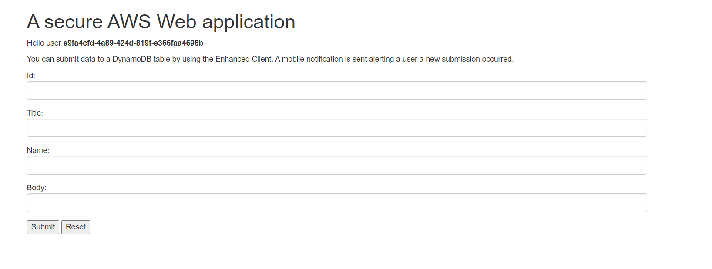
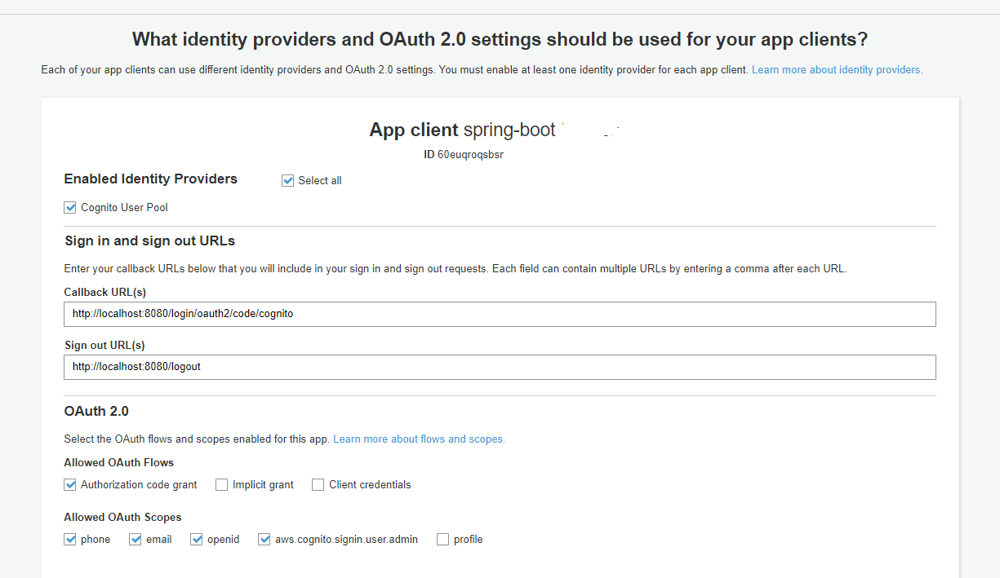
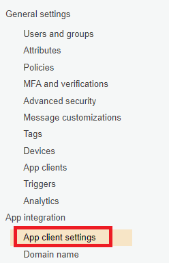
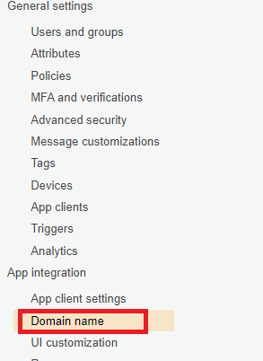
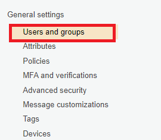
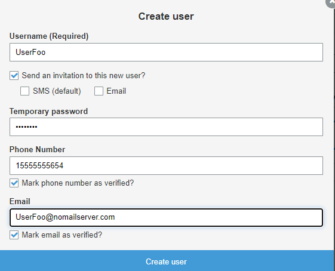

# Using Amazon Cognito to require a user to log into a web application

Amazon Cognito lets you add user sign-up, sign-in, and access control to your web applications. Amazon Cognito scales to millions of users and supports sign-in with social identity providers, such as Facebook, Google, and Amazon, and enterprise identity providers such as OAuth2. In this AWS tutorial, OAuth2 and Amazon Cognito are used to protect a web application. This means a user has to log into the application by using the credentials of a user defined in an Amazon Cognito User Pool. For example, when a user accesses a web application, they see a web page that lets anonymous users view a log in page, as shown in the following illustration.   

When the user clicks the log in button, they are presented with a log in form where they can enter their user credentials.

After the user enters their credentials, they can access the web application. 

**Note**: The Spring Boot application used in this AWS tutorial is created by following [Creating your first AWS Java web application](https://github.com/awsdocs/aws-doc-sdk-examples/tree/master/javav2/usecases/creating_first_project). Before following along with this AWS tutorial, you must complete that AWS tutorial. 

The following illustration shows the project files created in this tutorial (most of these files were created by following the tutorial referenced in the previous link). The files circled in red are the new files specific to this AWS tutorial. 

## Prerequisites

To complete the tutorial, you need the following:

+ An AWS account
+ A Java IDE (this example uses IntelliJ)
+ Java 1.8 SDK and Maven
+ Complete the Creating your first AWS Java web application tutorial. 

**Cost to complete:** The AWS services you'll use in this example are part of the [AWS Free Tier](https://aws.amazon.com/free/?all-free-tier.sort-by=item.additionalFields.SortRank&all-free-tier.sort-order=asc).

**Note:** When you're done developing the application, be sure to delete all of the resources you created to ensure that you're not charged.

**Topics**

+ Update the POM file
+ Create an Amazon Cognito User Pool
+	Define a client application within the User Pool
+	Configure the client application
+	Configure a domain name
+	Create a user
+	Modify your web application

## Update the POM file

The first step in this AWS tutorial is to update the POM file in your project to ensure you have the required dependencies (this is the project you created by following the Creating your first AWS Java web application tutorial). Ensure your project has the following POM dependencies. 

      <?xml version="1.0" encoding="UTF-8"?>
      <project xmlns="http://maven.apache.org/POM/4.0.0"
         xmlns:xsi="http://www.w3.org/2001/XMLSchema-instance"
         xsi:schemaLocation="http://maven.apache.org/POM/4.0.0 http://maven.apache.org/xsd/maven-4.0.0.xsd">
     <modelVersion>4.0.0</modelVersion>
     <groupId>GreetingCognito</groupId>
     <artifactId>GreetingCognito</artifactId>
     <version>1.0-SNAPSHOT</version>
     <parent>
        <groupId>org.springframework.boot</groupId>
        <artifactId>spring-boot-starter-parent</artifactId>
        <version>2.3.0.RELEASE</version>
        <relativePath/> <!-- lookup parent from repository -->
     </parent>
     <properties>
        <project.build.sourceEncoding>UTF-8</project.build.sourceEncoding>
        <java.version>1.8</java.version>
     </properties>
     <dependencyManagement>
        <dependencies>
            <dependency>
                <groupId>software.amazon.awssdk</groupId>
                <artifactId>bom</artifactId>
                <version>2.15.0</version>
                <type>pom</type>
                <scope>import</scope>
            </dependency>
        </dependencies>
     </dependencyManagement>
     <dependencies>
        <dependency>
            <groupId>software.amazon.awssdk</groupId>
            <artifactId>dynamodb-enhanced</artifactId>
            <version>2.11.0-PREVIEW</version>
        </dependency>
        <dependency>
            <groupId>software.amazon.awssdk</groupId>
            <artifactId>dynamodb</artifactId>
         </dependency>
        <dependency>
            <groupId>software.amazon.awssdk</groupId>
            <artifactId>sns</artifactId>
        </dependency>
        <dependency>
            <groupId>org.springframework.boot</groupId>
            <artifactId>spring-boot-starter-web</artifactId>
        </dependency>
        <dependency>
            <groupId>org.springframework.boot</groupId>
            <artifactId>spring-boot-starter-thymeleaf</artifactId>
        </dependency>
        <dependency>
            <groupId>org.springframework.boot</groupId>
            <artifactId>spring-boot-starter-security</artifactId>
        </dependency>
        <dependency>
            <groupId>org.springframework.boot</groupId>
            <artifactId>spring-boot-starter-oauth2-client</artifactId>
        </dependency>
        <dependency>
            <groupId>org.thymeleaf.extras</groupId>
            <artifactId>thymeleaf-extras-springsecurity5</artifactId>
        </dependency>
     </dependencies>
     <build>
        <plugins>
            <plugin>
                <groupId>org.springframework.boot</groupId>
                <artifactId>spring-boot-maven-plugin</artifactId>
            </plugin>
        </plugins>
       </build>
     </project>

## Create an Amazon Cognito User Pool

Create a User Pool in the AWS Management Console named **spring-example**. Once the User Pool is successfully created, you see a confirmation message.

1. Open the Amazon Cognito console at https://console.aws.amazon.com/cognito/home.

2. Choose the **Manage User Pools** button. 

3. Choose the **Create a user pool** button.

4. In the **Pool name** field, enter **spring-example**. 

5. Choose **Review Defaults**.

6. Choose **Create Pool**. 

## Define a client application within the User Pool

Define the client application that can use the User Pool. 

1. Choose **App clients** from the menu on the left side. 

2. Choose **Add an app client**.

3. Specify a name for the client application. For example, **spring-boot**.

4. Choose **Create client app**.

5. Write down the generated App client id and App client secret values (you need these values for a later step in this tutorial).

## Configure the client application

You must configure the client application. For example, you need to define the allowed OAuth scope values, as shown in this illustration.

1. Choose **App client settings** from the menu on the left side. 

2. Specify the correct callback URL. For example, with Spring Security, you can define the path as http://localhost:8080/login/oauth2/code/cognito. For local development, the localhost URL is all that is required. 

**Note**: For production applications, you can enter multiple production URLs as a comma-separated list.

3. For the **Sign out URL**, specify http://localhost:8080/logout. 

4. Select **Authorization code grant** and allow **email** and **openid** scope (shown in the previous illustration).

5. Choose **Save Changes**. 

## Configure a domain name

In order for a Spring Boot application to use the log in form that is provided by Amazon Cognito, define a domain name in the AWS Management Console. 

1. Choose **Domain name** from the menu on the left side. 

2. Enter a domain name. Be sure to choose the **Check availability** button to see if your value is valid.

3. Choose **Save Changes**. 

## Create a user

Create a user that you can use to log into the application. In this example, the user has a user name and a password. 

1. Choose **Users and groups** from the menu on the left side. 

2. Choose **Create User**.

3. In the Create user dialog, enter the user name and other information. 

**Note**: The user has a temporary password that should be changed to a regular password before logging into an application.

4. Choose **Create user**.

After the user is confirmed, you see the valid users, as shown in this illustration.

At this point, you need the following values to proceed: client id, client secret, pool id value, and the AWS region you are using. Without all of these values, you cannot use Amazon Cognito to require a user to log into your web application. 

## Modify your web application

If you do not have a web project, create one by following [Creating your first AWS Java web application](https://github.com/awsdocs/aws-doc-sdk-examples/tree/master/javav2/usecases/creating_first_project).

### Create the WebSecurityConfig Java class

Add the **WebSecurityConfig** class to the **com.example.handlingformsubmission** package. This file ensures that the application rerquires a user to log into it. The following Java code represents this class. 

     package com.example.handlingformsubmission;

    import org.springframework.context.annotation.Configuration;
    import org.springframework.security.config.annotation.web.builders.HttpSecurity;
    import org.springframework.security.config.annotation.web.configuration.WebSecurityConfigurerAdapter;

    @Configuration
    public class WebSecurityConfig extends WebSecurityConfigurerAdapter {

    @Override
    protected void configure(HttpSecurity http) throws Exception {
        http
                .csrf()
                .and()
                .authorizeRequests(authorize ->
                        authorize.mvcMatchers("/").permitAll()
                                .anyRequest().authenticated())
                .oauth2Login()
                .and()
                .logout()
                .logoutSuccessUrl("/");
      }
    }

### Add an application YML file to your project

Under your project’s resource folder, add a new file named **application.yml**. This file contains the information that is required to use Amazon Cognito. In this file, you specify the values that you obtained from the AWS Management Console, such as the client id, client secret, pool id values. The following code represents this file. 

     spring:
       security:
         oauth2:
          client:
           registration:
            cognito:
            clientId: <enter your client id value>
            clientSecret: <enter your client secret value>
            scope: openid, email
            redirectUriTemplate: http://localhost:8080/login/oauth2/code/cognito <your call back URL>
            clientName: spring-boot <The client app value you defined>
         provider:
          cognito:
            issuerUri: https://cognito-idp.<AWS Region>.amazonaws.com/<pool id value>
            
 ## Modify the greeting HTML file
 
The final step in the AWS tutorial is to modify the **greeting.html** file located under resources/templates folder. You have to add logic to inform the application what content is available for anonymous users and what content can be viewed by authenticated users. Add the following code to the **greeting.html** file. 

     <!DOCTYPE HTML>
     <html lang="en"
       xmlns:sec="http://www.thymeleaf.org/extras/spring-security"
       xmlns:th="http://www.thymeleaf.org">
    <head>
     <title>Getting Started: Spring Boot and the Enhanced DynamoDB Client</title>
     <meta http-equiv="Content-Type" content="text/html; charset=UTF-8" />
     <link rel="stylesheet" th:href="|https://maxcdn.bootstrapcdn.com/bootstrap/3.3.7/css/bootstrap.min.css|"/>
    </head>
    <body>
    

    

        
You must log in with Amazon Connito to access this AWS Web Application.

        <a class="btn btn-primary" th:href="@{/oauth2/authorization/cognito}" role="button">
            Log in using <b>Amazon Cognito</b>
        </a>
    

    

     <h1>A secure AWS Web application</h1>
     
Hello user <strong th:text="${#authentication.getName()}"></strong>

     
You can submit data to a DynamoDB table by using the Enhanced Client. A mobile notification is sent alerting a user a new submission occurred.

     <form action="#" th:action="@{/greeting}" th:object="${greeting}" method="post">
       

        
Id: <input type="text"  class="form-control" th:field="*{id}" />

        

        

            
Title: <input type="text" class="form-control" th:field="*{title}" />

        

        

            
Name: <input type="text" class="form-control" th:field="*{name}" />

        

        

            
Body: <input type="text" class="form-control" th:field="*{body}"/>

        

        
<input type="submit" value="Submit" /> <input type="reset" value="Reset" />

      </form>
        

            <form method="post" th:action="@{/logout}">
                <input type="submit" class="btn btn-danger" value="Logout"/>
            </form>
        

     

     

     </body>
    </html>

### Next steps
Congratulations, you have required a user to log into a web application by using Amazon Cognito. As stated at the beginning of this tutorial, be sure to terminate all of the resources you created while going through this tutorial to ensure that you’re not charged.

For more AWS multiservice examples, see
[usecases](https://github.com/awsdocs/aws-doc-sdk-examples/tree/master/javav2/usecases).

