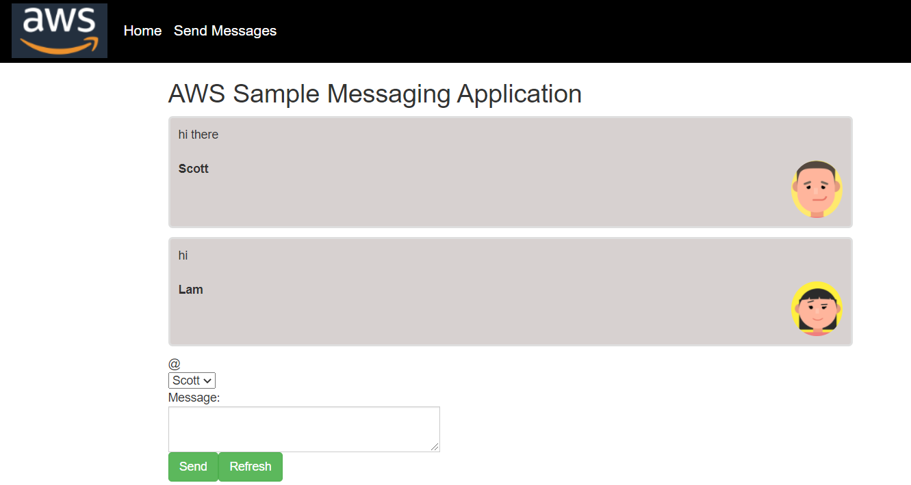
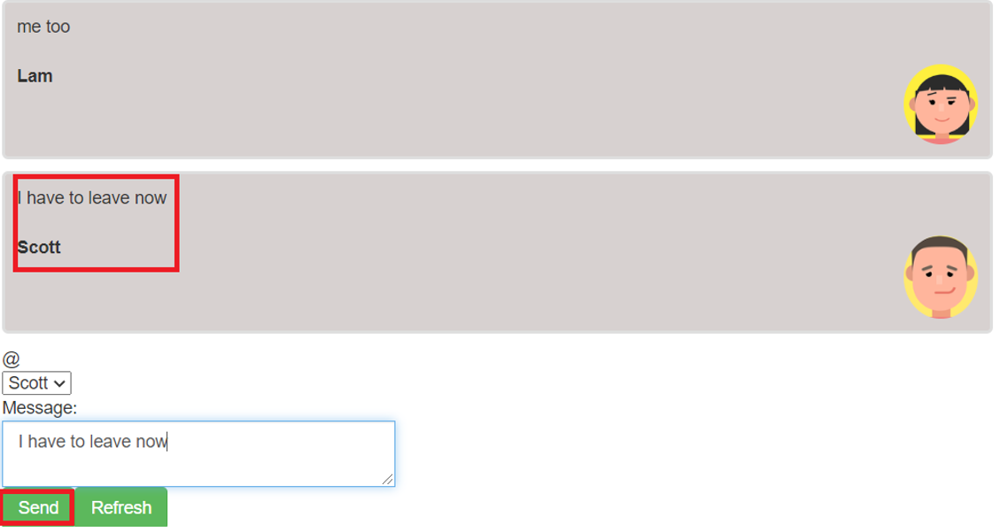

# Creating Sample Messaging Applications using the AWS SDK for Java

You can create an AWS application that sends and retrieves messages by using the AWS Java SDK and the Simple Queue Service (SQS). Messages are stored in a First in First out (FIFO) queue that ensures that the order of the messages are consistent. For example, the first message that is stored in the queue is the first message read from the queue.

**Note:** For more information about the SQS, see [What is Amazon Simple Queue Service?](https://docs.aws.amazon.com/AWSSimpleQueueService/latest/SQSDeveloperGuide/welcome.html). 

In this tutorial, you create a Spring Boot application named AWS Message application. The Spring Boot APIs are used to build a model, different views, and a controller. The following figure shows the AWS Message application.

**Cost to complete:** The AWS services you'll use in this example are part of the AWS Free Tier.

**Note:** When you're done developing the application, be sure to terminate all of the resources you created to ensure that you're  no longer charged.

#### Topics

+ Prerequisites
+ Understand the AWS Message application.
+ Create an IntelliJ project named SpringAWSMessage.
+ Add the POM dependencies to your project.
+ Create the Java classes. 
+ Create the HTML files.
+ Create the Script files.
+ Package the project into a Jar file.
+ Deploy the application to the AWS Elastic Beanstalk.

## Prerequisites

To follow along with the tutorial, you need the following:

+ An AWS Account.
+ A Java IDE (for this tutorial, the IntelliJ IDE is used).
+ Java 1.8 JDK. 
+ Maven 3.6 or higher.
+ A FIFO queue named Message.fifo. For information about creating a queue, see  [Creating an Amazon SQS queue](https://docs.aws.amazon.com/AWSSimpleQueueService/latest/SQSDeveloperGuide/sqs-configure-create-queue.html).

## Understand the AWS Message application

To send a message to a SQS queue, enter the message into the application and choose Send.  Once the message is sent, the application displays the message, as shown in this figure. 

The following describes how the application handles a message: 

+ The message and user values are posted to a Spring Controller.
+ The Spring Controller creates a custom **Message** object that stores the message Id value (a GUID value), the message text, and the user.
+ The Spring Controller passes the **Message** object to a message service that uses the **software.amazon.awssdk.services.sqs.SqsClient** client object to store the data into a FIFO queue
+ The Spring Controller invokes the Message service’s **getMessages** method to read all of the messages in the queue. This method returns an XML document that contains all messages.
+ The XML is passed back to the view where the messages are parsed and displayed in the view.  

## Create an IntelliJ project named SpringAWSMessage

1. In the IntelliJ IDE, choose **File**, **New**, **Project**. 
2. In the **New Project** dialog box, choose **Maven**, and then choose **Next**. 
3. For **GroupId**, enter **aws-springmessage**. 
4. For **ArtifactId**, enter **SpringAWSMessage**. 
6. Choose **Next**.
7. Choose **Finish**. 

## Add the POM dependencies to your project

At this point, you have a new project named **SpringPhotoAnalyzer**.

Add the following dependency for the Amazon SQS API (AWS Java SDK version 2).

    <dependency>
       <groupId>software.amazon.awssdk</groupId>
       <artifactId>sqs</artifactId>
    </dependency>
    
**Note**: Ensure that you are using Java 1.8 as shown in the POM file below.    

  Add the Spring Boot dependencies. The pom.xml file looks like the following.
  
    <?xml version="1.0" encoding="UTF-8"?>
    <project xmlns="http://maven.apache.org/POM/4.0.0"
         xmlns:xsi="http://www.w3.org/2001/XMLSchema-instance"
         xsi:schemaLocation="http://maven.apache.org/POM/4.0.0 http://maven.apache.org/xsd/maven-4.0.0.xsd">
    <modelVersion>4.0.0</modelVersion>

    <groupId>SpringAWSMessage</groupId>
    <artifactId>SpringAWSMessage</artifactId>
    <version>1.0-SNAPSHOT</version>
    <parent>
        <groupId>org.springframework.boot</groupId>
        <artifactId>spring-boot-starter-parent</artifactId>
        <version>2.2.5.RELEASE</version>
        <relativePath/> <!-- lookup parent from repository -->
    </parent>

    <properties>
        <java.version>1.8</java.version>
    </properties>
    <dependencyManagement>
        <dependencies>
            <dependency>
                <groupId>software.amazon.awssdk</groupId>
                <artifactId>bom</artifactId>
                <version>2.10.54</version>
                <type>pom</type>
                <scope>import</scope>
            </dependency>
        </dependencies>
    </dependencyManagement>
    <dependencies>
        <dependency>
            <groupId>software.amazon.awssdk</groupId>
            <artifactId>sqs</artifactId>
        </dependency>
        <dependency>
            <groupId>org.springframework.boot</groupId>
            <artifactId>spring-boot-starter-thymeleaf</artifactId>
        </dependency>
        <dependency>
            <groupId>org.springframework.boot</groupId>
            <artifactId>spring-boot-starter-web</artifactId>
        </dependency>
        <dependency>
            <groupId>org.springframework.boot</groupId>
            <artifactId>spring-boot-starter-test</artifactId>
            <scope>test</scope>
            <exclusions>
                <exclusion>
                    <groupId>org.junit.vintage</groupId>
                    <artifactId>junit-vintage-engine</artifactId>
                </exclusion>
            </exclusions>
        </dependency>
        <dependency>
            <groupId>software.amazon.awssdk</groupId>
            <artifactId>dynamodb-enhanced</artifactId>
            <version>2.11.0-PREVIEW</version>
        </dependency>
        <dependency>
            <groupId>software.amazon.awssdk</groupId>
            <artifactId>dynamodb</artifactId>
            <version>2.5.10</version>
        </dependency>
        <dependency>
            <groupId>software.amazon.awssdk</groupId>
            <artifactId>sns</artifactId>
        </dependency>
    </dependencies>
    <build>
        <plugins>
            <plugin>
                <groupId>org.springframework.boot</groupId>
                <artifactId>spring-boot-maven-plugin</artifactId>
            </plugin>
        </plugins>
     </build>
    </project>

## Create the Java classes 

Create a Java package in the main/java folder named com.example.
