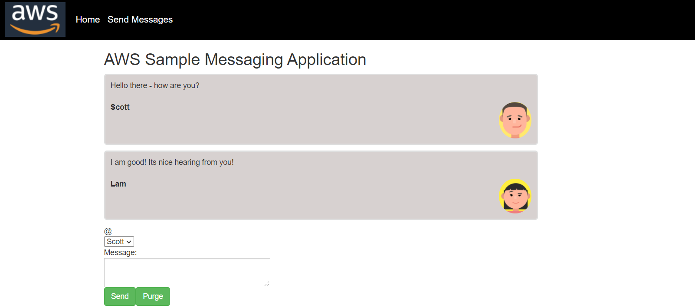
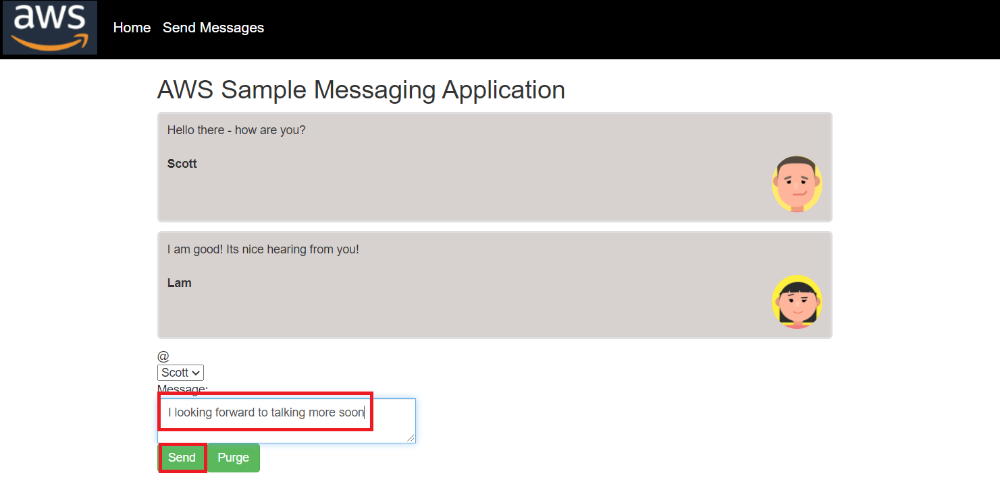
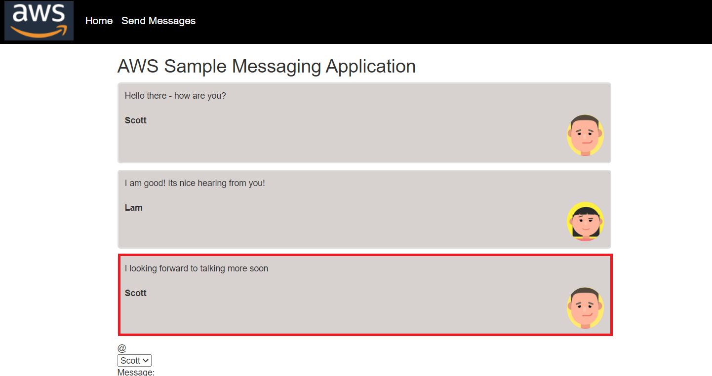
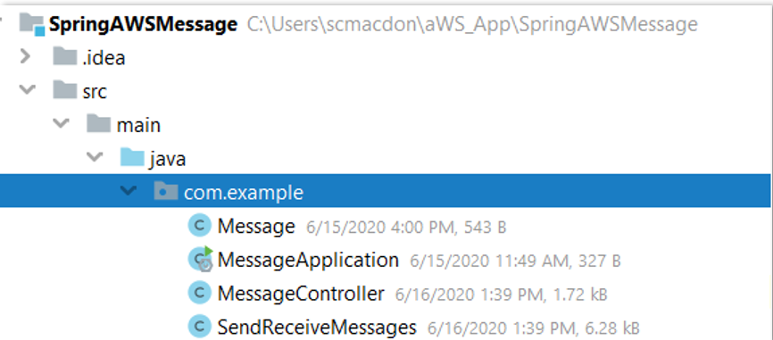

# Creating Sample Messaging Applications using the AWS SDK for Java

You can create an AWS application that sends and retrieves messages by using the AWS Java SDK and the Simple Queue Service (SQS). Messages are stored in a First in First out (FIFO) queue that ensures that the order of the messages are consistent. For example, the first message that is stored in the queue is the first message read from the queue.

**Note:** For more information about the SQS, see [What is Amazon Simple Queue Service?](https://docs.aws.amazon.com/AWSSimpleQueueService/latest/SQSDeveloperGuide/welcome.html). 

In this tutorial, you create a Spring Boot application named AWS Message application. The Spring Boot APIs are used to build a model, different views, and a controller. The following figure shows the AWS Message application.

**Cost to complete:** The AWS services you'll use in this example are part of the AWS Free Tier.

**Note:** When you're done developing the application, be sure to terminate all of the resources you created to ensure that you're  no longer charged.

#### Topics

+ Prerequisites
+ Understand the AWS Message application.
+ Create an IntelliJ project named SpringAWSMessage.
+ Add the POM dependencies to your project.
+ Create the Java classes. 
+ Create the HTML files.
+ Create the Script files.
+ Package the project into a Jar file.
+ Deploy the application to the AWS Elastic Beanstalk.

## Prerequisites

To follow along with the tutorial, you need the following:

+ An AWS Account.
+ A Java IDE (for this tutorial, the IntelliJ IDE is used).
+ Java 1.8 JDK. 
+ Maven 3.6 or higher.
+ A FIFO queue named Message.fifo. For information about creating a queue, see  [Creating an Amazon SQS queue](https://docs.aws.amazon.com/AWSSimpleQueueService/latest/SQSDeveloperGuide/sqs-configure-create-queue.html).

## Understand the AWS Message application

To send a message to a SQS queue, enter the message into the application and choose Send.  On

Occe the message is sent, the application displays the message, as shown in this figure. 

You can choose the **Purge** button to purge the messages from the FIFO queue. This results in the queue being empty and no messages are displayed in the application.  

The following describes how the application handles a message: 

+ The message and user values are posted to a Spring Controller.
+ The Spring Controller creates a custom **Message** object that stores the message Id value (a GUID value), the message text, and the user.
+ The Spring Controller passes the **Message** object to a message service that uses the **software.amazon.awssdk.services.sqs.SqsClient** client object to store the data into a FIFO queue
+ The Spring Controller invokes the Message service’s **getMessages** method to read all of the messages in the queue. This method returns an XML document that contains all messages.
+ The XML is passed back to the view where the messages are parsed and displayed in the view.  

## Create an IntelliJ project named SpringAWSMessage

1. In the IntelliJ IDE, choose **File**, **New**, **Project**. 
2. In the **New Project** dialog box, choose **Maven**, and then choose **Next**. 
3. For **GroupId**, enter **aws-springmessage**. 
4. For **ArtifactId**, enter **SpringAWSMessage**. 
6. Choose **Next**.
7. Choose **Finish**. 

## Add the POM dependencies to your project

At this point, you have a new project named **SpringPhotoAnalyzer**.

Add the following dependency for the Amazon SQS API (AWS Java SDK version 2).

    <dependency>
       <groupId>software.amazon.awssdk</groupId>
       <artifactId>sqs</artifactId>
    </dependency>
    
**Note**: Ensure that you are using Java 1.8 as shown in the POM file below.    

  Add the Spring Boot dependencies. The pom.xml file looks like the following.
  
    <?xml version="1.0" encoding="UTF-8"?>
    <project xmlns="http://maven.apache.org/POM/4.0.0"
         xmlns:xsi="http://www.w3.org/2001/XMLSchema-instance"
         xsi:schemaLocation="http://maven.apache.org/POM/4.0.0 http://maven.apache.org/xsd/maven-4.0.0.xsd">
    <modelVersion>4.0.0</modelVersion>

    <groupId>SpringAWSMessage</groupId>
    <artifactId>SpringAWSMessage</artifactId>
    <version>1.0-SNAPSHOT</version>
    <parent>
        <groupId>org.springframework.boot</groupId>
        <artifactId>spring-boot-starter-parent</artifactId>
        <version>2.2.5.RELEASE</version>
        <relativePath/> <!-- lookup parent from repository -->
    </parent>

    <properties>
        <java.version>1.8</java.version>
    </properties>
    <dependencyManagement>
        <dependencies>
            <dependency>
                <groupId>software.amazon.awssdk</groupId>
                <artifactId>bom</artifactId>
                <version>2.10.54</version>
                <type>pom</type>
                <scope>import</scope>
            </dependency>
        </dependencies>
    </dependencyManagement>
    <dependencies>
        <dependency>
            <groupId>software.amazon.awssdk</groupId>
            <artifactId>sqs</artifactId>
        </dependency>
        <dependency>
            <groupId>org.springframework.boot</groupId>
            <artifactId>spring-boot-starter-thymeleaf</artifactId>
        </dependency>
        <dependency>
            <groupId>org.springframework.boot</groupId>
            <artifactId>spring-boot-starter-web</artifactId>
        </dependency>
        <dependency>
            <groupId>org.springframework.boot</groupId>
            <artifactId>spring-boot-starter-test</artifactId>
            <scope>test</scope>
            <exclusions>
                <exclusion>
                    <groupId>org.junit.vintage</groupId>
                    <artifactId>junit-vintage-engine</artifactId>
                </exclusion>
            </exclusions>
        </dependency>
        <dependency>
            <groupId>software.amazon.awssdk</groupId>
            <artifactId>dynamodb-enhanced</artifactId>
            <version>2.11.0-PREVIEW</version>
        </dependency>
        <dependency>
            <groupId>software.amazon.awssdk</groupId>
            <artifactId>dynamodb</artifactId>
            <version>2.5.10</version>
        </dependency>
        <dependency>
            <groupId>software.amazon.awssdk</groupId>
            <artifactId>sns</artifactId>
        </dependency>
    </dependencies>
    <build>
        <plugins>
            <plugin>
                <groupId>org.springframework.boot</groupId>
                <artifactId>spring-boot-maven-plugin</artifactId>
            </plugin>
        </plugins>
     </build>
    </project>

## Create the Java classes 

Create a Java package in the main/java folder named **com.example**.

The Java files go into this package.

Create these Java classes: 

+ **Message** - Used as the model for this application.
+ **MessageApplication** - Used as the base class for the Spring Boot application.
+ **MessageController** - Used as the Spring Boot Controller that handles HTTP requests. 
+ **SendRecieveMessages** - Uses the Amazon SQS API to process messages.  
  
### Message class

The **Message** class represents the application’s model.

     package com.example;

public class Message {

    private String id;
    private String body;
    private String name;

    public String getName() {
        return this.name;
    }

    public void setName(String name) {
        this.name = name;
    }

    public String getId() {
        return id;
    }

    public void setId(String id) {
        this.id = id;
    }

    public String getBody() {
        return this.body;
    }

    public void setBody(String body) {
        this.body = body;
     }
    }
    
### MessageApplication class

The following Java code represents the **MessageApplication** class. This class represents the entry point into the Spring Boot application. 

     package com.example;

     import org.springframework.boot.SpringApplication;
     import org.springframework.boot.autoconfigure.SpringBootApplication;

     @SpringBootApplication
     public class MessageApplication {

    public static void main(String[] args) {
        SpringApplication.run(MessageApplication.class, args);
     }
    }

### MessageController class

The following Java code represents the **MainController** class that handles HTTP requests. For example, when a new message is posted, the **addItems** method handles the request.  

     package com.example;

     import org.springframework.beans.factory.annotation.Autowired;
     import org.springframework.stereotype.Controller;
     import org.springframework.ui.Model;
     import org.springframework.web.bind.annotation.*;

     import javax.servlet.http.HttpServletRequest;
     import javax.servlet.http.HttpServletResponse;
     import java.util.UUID;

     @Controller
     public class MessageController {

    @Autowired
    SendReceiveMessages msgService;

    @GetMapping("/")
    public String root() {
        return "index";
    }
    
    //  Purge the queue
    @RequestMapping(value = "/purge", method = RequestMethod.GET)
    @ResponseBody
    String purgeMessages(HttpServletRequest request, HttpServletResponse response) {

        msgService.purgeMyQueue();
        return "Queue is purged";
    }

    // Gets messages
    @RequestMapping(value = "/populate", method = RequestMethod.GET)
    @ResponseBody
    String getItems(HttpServletRequest request, HttpServletResponse response) {

       String xml= msgService.getMessages();
       return xml;
    }

    //  Creates a new message
    @RequestMapping(value = "/add", method = RequestMethod.POST)
    @ResponseBody
    String addItems(HttpServletRequest request, HttpServletResponse response) {

        String user = request.getParameter("user");
        String message = request.getParameter("message");

        // generate the ID
        UUID uuid = UUID.randomUUID();
        String msgId = uuid.toString();

        Message messageOb = new Message();
        messageOb.setId(msgId);
        messageOb.setName(user);
        messageOb.setBody(message);

        msgService.processMessage(messageOb);
        String xml= msgService.getMessages();

        return xml;
        }

      @GetMapping("/message")
      public String greetingForm(Model model) {
        model.addAttribute("greeting", new Message());
        return "message";
       }
      }
      
### SendReceiveMessages  class

The following class uses the Amazon SQS API to send and retrieve messages. For example, the **getMessages** method retrieve message from the queue. Likewise, the **processMessage** method sends a message to a queue.

        package com.example;

        import org.springframework.stereotype.Component;
        import software.amazon.awssdk.auth.credentials.EnvironmentVariableCredentialsProvider;
        import software.amazon.awssdk.regions.Region;
        import software.amazon.awssdk.services.sqs.SqsClient;
        import software.amazon.awssdk.services.sqs.model.*;
        import software.amazon.awssdk.services.sqs.model.ReceiveMessageRequest;
        import software.amazon.awssdk.services.sqs.model.Message;
        import software.amazon.awssdk.services.sqs.model.PurgeQueueRequest;
        import org.w3c.dom.Document;
        import javax.xml.parsers.DocumentBuilder;
        import javax.xml.parsers.DocumentBuilderFactory;
        import javax.xml.parsers.ParserConfigurationException;
        import javax.xml.transform.Transformer;
        import javax.xml.transform.TransformerException;
        import javax.xml.transform.TransformerFactory;
        import javax.xml.transform.dom.DOMSource;
        import javax.xml.transform.stream.StreamResult;
        import org.w3c.dom.Element;
        import java.io.StringWriter;
        import java.util.*;

        @Component
        public class SendReceiveMessages {

        private final String QUEUE_NAME = "Message.fifo";

        private SqsClient getClient() {
            SqsClient sqsClient = SqsClient.builder()
             .region(Region.US_WEST_2)
             .credentialsProvider(EnvironmentVariableCredentialsProvider.create())
             .build();

        return sqsClient;
        }

        public void purgeMyQueue() {

        SqsClient sqsClient = getClient();

        GetQueueUrlRequest getQueueRequest = GetQueueUrlRequest.builder()
                .queueName(QUEUE_NAME)
                .build();

        PurgeQueueRequest queueRequest = PurgeQueueRequest.builder()
                .queueUrl(sqsClient.getQueueUrl(getQueueRequest).queueUrl())
                .build();

        sqsClient.purgeQueue(queueRequest);
        }

        public String getMessages() {

        List attr = new ArrayList<String>();
        attr.add("Name");

        SqsClient sqsClient = getClient();

        try {

        GetQueueUrlRequest getQueueRequest = GetQueueUrlRequest.builder()
                .queueName(QUEUE_NAME)
                .build();

        String queueUrl = sqsClient.getQueueUrl(getQueueRequest).queueUrl();

        // Receive messages from the queue
        ReceiveMessageRequest receiveRequest = ReceiveMessageRequest.builder()
                .queueUrl(queueUrl)
                .maxNumberOfMessages(10)
                .messageAttributeNames(attr)
                .build();
        List<Message> messages = sqsClient.receiveMessage(receiveRequest).messages();

        com.example.Message myMessage;

        List allMessages = new ArrayList<com.example.Message>();

        // Push the messages to a list
        for (Message m : messages) {

            myMessage=new com.example.Message();
            myMessage.setBody(m.body());

            Map map = m.messageAttributes();
            MessageAttributeValue val=(MessageAttributeValue)map.get("Name");
            myMessage.setName(val.stringValue());

            allMessages.add(myMessage);
        }

        return convertToString(toXml(allMessages));

        } catch (SqsException e) {
            e.getStackTrace();
        }
        return "";
        }

        public void processMessage(com.example.Message msg) {

        SqsClient sqsClient = SqsClient.builder()
                .region(Region.US_WEST_2)
                .build();

        try {

            // Get user
            MessageAttributeValue attributeValue = MessageAttributeValue.builder()
                    .stringValue(msg.getName())
                    .dataType("String")
                    .build();

            Map myMap = new HashMap<String, MessageAttributeValue>();
            myMap.put("Name", attributeValue);

            GetQueueUrlRequest getQueueRequest = GetQueueUrlRequest.builder()
                    .queueName(QUEUE_NAME)
                    .build();

            String queueUrl = sqsClient.getQueueUrl(getQueueRequest).queueUrl();

            // generate the work item ID
            UUID uuid = UUID.randomUUID();
            String msgId1 = uuid.toString();

            SendMessageRequest sendMsgRequest = SendMessageRequest.builder()
                    .queueUrl(queueUrl)
                    .messageAttributes(myMap)
                    .messageGroupId("GroupA")
                    .messageDeduplicationId(msgId1)
                    .messageBody(msg.getBody())
                    .build();
            sqsClient.sendMessage(sendMsgRequest);

        } catch (SqsException e) {
             e.getStackTrace();
        }
        }

        // Convert item data retrieved from the Message Queue
        // into XML to pass back to the view
        private Document toXml(List<com.example.Message> itemList) {

        try {
            DocumentBuilderFactory factory = DocumentBuilderFactory.newInstance();
            DocumentBuilder builder = factory.newDocumentBuilder();
            Document doc = builder.newDocument();

            // Start building the XML
            Element root = doc.createElement( "Messages" );
            doc.appendChild( root );

            // Get the elements from the collection
            int custCount = itemList.size();

            // Iterate through the collection
            for ( int index=0; index < custCount; index++) {

                // Get the WorkItem object from the collection
                com.example.Message myMessage = itemList.get(index);

                Element item = doc.createElement( "Message" );
                root.appendChild( item );

                // Set Id
                Element id = doc.createElement( "Data" );
                id.appendChild( doc.createTextNode(myMessage.getBody()));
                item.appendChild( id );

                // Set Name
                Element name = doc.createElement( "User" );
                name.appendChild( doc.createTextNode(myMessage.getName() ) );
                item.appendChild( name );

             }

                return doc;
            } catch(ParserConfigurationException e) {
            e.printStackTrace();
            }
            return null;
            }

        private String convertToString(Document xml) {
            try {
            Transformer transformer = TransformerFactory.newInstance().newTransformer();
            StreamResult result = new StreamResult(new StringWriter());
            DOMSource source = new DOMSource(xml);
            transformer.transform(source, result);
            return result.getWriter().toString();

        } catch(TransformerException ex) {
            ex.printStackTrace();
        }
        return null;
    }
}
      
## Create the HTML files

At this point, you have created all of the Java files required for the AWS Message application. Now you create the HTML files that are required for the application's graphical user interface (GUI). Under the resource folder, create a template folder and then create the following HTML files:

+ index.html
+ message.html
+ layout.html

The **index.html** file is the application's home view. The **message.html** file represents the view for sending messages. Finally, the **layout.html** file represents the menu visible in all views.

### index.html

The following HTML code represents the **index.html** file.

     <!DOCTYPE html>
     <html xmlns:th="http://www.thymeleaf.org" xmlns:sec="http://www.thymeleaf.org/thymeleaf-extras-springsecurity3">
     <head>
    <meta charset="utf-8" />
    <meta http-equiv="X-UA-Compatible" content="IE=edge" />
    <meta name="viewport" content="width=device-width, initial-scale=1" />

    <link rel="stylesheet" th:href="|https://maxcdn.bootstrapcdn.com/bootstrap/3.3.7/css/bootstrap.min.css|"/>
    <link rel="stylesheet" href="../public/css/styles.css" th:href="@{/css/styles.css}" />
    <link rel="icon" href="../public/images/favicon.ico" th:href="@{/images/favicon.ico}" />

    <title>AWS Sample Messaging Application</title>
    </head>

    <body>
    <header th:replace="layout :: site-header"/>
    

    <h2>AWS Sample Message Application</h2>

    
The AWS Sample Messaging application is a sample application that uses the Simple Queue Service as well as other AWS Services and the Java V2 API.
     Working with messages has never been easier! Simply perform these steps:

       <ol>
        <li>You can send a new message by choosing the <i>Send Messages</i> menu item. Select a user from the form, enter a message and then choose <i>Send</i>.</li>
        <li>The AWS Message application stores the message in a First in First Out (FIFO) queue. This queue ensure that the order of the messages are consisent.</li>
        <li>The AWS Message application polls the queue for all messages in the FIFO queue.</li>
        <li>The AWS Message application displays the message data in the view. The message body, user name, and an avatar is displayd.</li>
        <li>You can send and view multiple messages by using the AWS Message application. </li>
         <li>You can purge the queue. </li>
        </ol>
     

    </body>
    </html>

### message.html

The following HTML file represents the **message.html** file. 

     <!DOCTYPE HTML>
     <html xmlns:th="https://www.thymeleaf.org">
     <head>
     <meta name="viewport" content="width=device-width, initial-scale=1">
     
     
     
     <link rel="stylesheet" th:href="|https://maxcdn.bootstrapcdn.com/bootstrap/3.3.7/css/bootstrap.min.css|"/>
     <link rel="stylesheet" href="../public/css/styles.css" th:href="@{/css/styles.css}" />
     <link rel="icon" href="../public/images/favicon.ico" th:href="@{/images/favicon.ico}" />

     
     </head>
     <body>
     <header th:replace="layout :: site-header"/>

    

     <h2>AWS Sample Messaging Application</h2>
    

    

    

    

        @
    

    <select name="cars" id="username">
        <option value="Scott">Scott</option>
        <option value="Lam">Lam</option>
    </select>
    

    

     

        Message:
     

     <textarea class="form-control" id="textarea" aria-label="With textarea"></textarea>
     <button type="button" onclick="pushMessage()" id="send" class="btn btn-success">Send</button>
     <button type="button" onclick="purge()" id="refresh" class="btn btn-success">Purge</button>
     

    

    <!-- All of these child items are hidden and only displayed in a FancyBox ------------------------------------------------------>
    

    

        
        
Sweet! So, what do you wanna do today?

        11:02
     

    

    </body>
    </html>

### layout.html

The following code represents the **layout.html** file that represents the application's menu.

     <!DOCTYPE html>
     <html xmlns:th="http://www.thymeleaf.org">
     <head th:fragment="site-head">
     <meta charset="UTF-8" />
     <link rel="icon" href="../public/images/favicon.ico" th:href="@{/images/favicon.ico}" />
     
    <meta th:include="this :: head" th:remove="tag"/>
    </head>
    <body>
    <!-- th:hef calls a controller method - which returns the view -->
    <header th:fragment="site-header">
     
     <a href="#" style="color: white" th:href="@{/}">Home</a>
     <a href="#" style="color: white" th:href="@{/message}">Send Messages</a>
    </header>
    <h1>Welcome</h1>
    <body>
    
Welcome to  AWS Sample SQS app.

    </body>
    </html>
    
## Create script files

Create a script file named **message.js** that communicates with the Spring controller. This file is used by the **message.html** view. Place the script file in this path:

**resources\public\js**

The following code represents this JS file. 

     $(function() {

     populateChat()
     } );

    function populateChat() {

     // Post the values to the controller
    var xhr = new XMLHttpRequest();
    xhr.addEventListener("load", handle, false);
    xhr.open("GET", "../populate", true);   
    xhr.setRequestHeader("Content-type", "application/x-www-form-urlencoded");//necessary
    xhr.send();
    }

    function handle(event) {

      var xml = event.target.responseText;
      $("#messages").children().remove();
      $(xml).find('Message').each(function () {
      var $field = $(this);
      var body = $field.find('Data').text();
      var name = $field.find('User').text();

      // Set the view
      var userText = body +'  <b>' + name  ;
      var myTextNode = $("#base").clone();
      myTextNode.text(userText) ;
      var image_url;
      var n = name.localeCompare("Scott");

      if (n == 0)
            image_url = "../images/av1.png";
        else
            image_url = "../images/av2.png";
      
      var images_div = "";
      myTextNode.html(userText) ;
      myTextNode.append(images_div);
      $("#messages").append(myTextNode);
      });
     }

     function purge() {

    //Post the values to the controller
    //invokes the getMyForms POST operation
    var xhr = new XMLHttpRequest();
    xhr.addEventListener("load", purgeItems, false);
    xhr.open("GET", "../purge", true);   
    xhr.setRequestHeader("Content-type", "application/x-www-form-urlencoded");
    xhr.send();
    }

    function purgeItems(event) {

    var msg = event.target.responseText;
    alert(msg);
    populateChat();
    }
     
     function pushMessage() {

       var user =  $('#username').val();
       var message = $('#textarea').val();

       // Post the values to the controller
       var xhr = new XMLHttpRequest();
       xhr.addEventListener("load", loadNewItems, false);
       xhr.open("POST", "../add", true);   
       xhr.setRequestHeader("Content-type", "application/x-www-form-urlencoded");
       xhr.send("user=" + user + "&message=" + message);
       }

      function loadNewItems(event) {

       var xml = event.target.responseText;
       $("#messages").children().remove();
        $(xml).find('Message').each(function () {

       var $field = $(this);
       var body = $field.find('Data').text();
       var name = $field.find('User').text();

        // Set the view
        var userText = body +'  <b>' + name  ;
        var myTextNode = $("#base").clone();
        myTextNode.text(userText) ;
        var image_url;

        var n = name.localeCompare("Scott");
        if (n == 0)
            image_url = "../images/av1.png";
        else
           image_url = "../images/av2.png";
        var images_div = "";

        myTextNode.html(userText) ;
        myTextNode.append(images_div);
        $("#messages").append(myTextNode);
        });
        }

**Note**: Be sure to include the CSS and image files located in Github into your project. 

## Package the project into an executable JAR

Package up the project into an executable .jar (JAR) file by using the following Maven command.

     mvn package
     
The JAR file is located in the target folder.

## Deploy to the Elastic Beanstalk

The final step is to deploy the application to the Elastic Beanstalk. To learn how to deploy a Spring application to the Elastic Beanstalk, see [Creating your first AWS Java Web Application](https://github.com/awsdocs/aws-doc-sdk-examples/tree/master/javav2/usecases/creating_first_project). 

### Next steps
Congratulations, you have created and deployed the Spring SQS application. As stated at the beginning of this tutorial, be sure to terminate all of the resources you create while going through this tutorial to ensure that you’re no longer charged.

You can read more AWS multi service examples by clicking 
[Usecases](https://github.com/awsdocs/aws-doc-sdk-examples/tree/master/javav2/usecases). 
